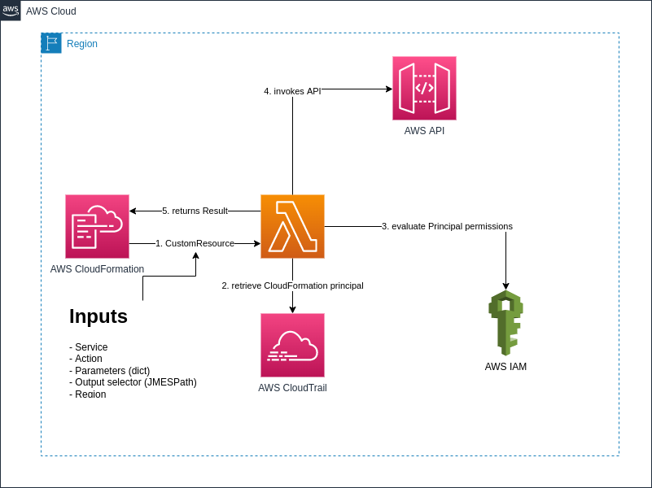

# CloudFormation data source
CloudFormation Data Source helps you retrieve dynamic values from any AWS API while deploying a CloudFormation template.

It allows you to simplify some CloudFormation templates by removing parameters and mappings and rely instead on AWS API to retrieve the correct value at deployment time. Example could be the Id of a VPC, a security group based on its name or tag value.

# How it works
This template deploys an AWS Lambda Function with View-Only permissions.
The lambda function will accept a payload with the following format:
```json
{
  "Service": "aws_service", 
  "Action": "NameOfActionInAPIReference",
  "Region": "AWSRegion",
  "Parameters": {},
  "Query": "JMESPath expression (see aws cli)"
}
```
When CloudFormation runs, it invokes the AWS Lambda Function as a [Custom Resource](https://docs.aws.amazon.com/AWSCloudFormation/latest/UserGuide/template-custom-resources.html).
The Lambda function performs the API call and return the result. If the API call fails, it will return a FAILED event to CloudFormation.

_Optional_

Before invoking the API, the Lambda function will look up the AWS Principal who triggered the CoudFormation template and check if it has the permissions to invoke the API.
# How to deploy
This template has been built with [AWS SAM CLI](https://docs.aws.amazon.com/serverless-application-model/latest/developerguide/serverless-sam-cli-install.html)

In order to deploy the template, clone this repository and run 
```bash
sam build
sam deploy --guided
```

# How to use

Create a custom resource in your Cloudformation template and the service token should be the Arn of the lambda function. The Arn is exported as CFNDATASOURCE, so you can use it simply by entering ServiceToken: !ImportValue CFNDATASOURCE
It requires the name of the Service ('organizations', 'ec2'...) and the Api to invoke ('DescribeOrganization'...), the parameters as a dict object (per the API reference of the service) and the query to filter the result using a JMESPath expression.
The example below shows how to return the OrganizationId
```yaml
Resources:
  rGetOrgId:
    Type: Custom::GetOrgId
    Properties:
      ServiceToken: !ImportValue CFNDATASOURCE
      Api: DescribeOrganization
      Service: organizations
      Region: !Ref AWS::Region
      Parameters: AWS::NoValue
      Query: "Organization.{Id:Id}"

Outputs:
  Output0:
    Description: OrganizationId
    Value: !GetAtt rGetOrgId.Id
```
# Architecture


More examples can be find out [here](examples.md)